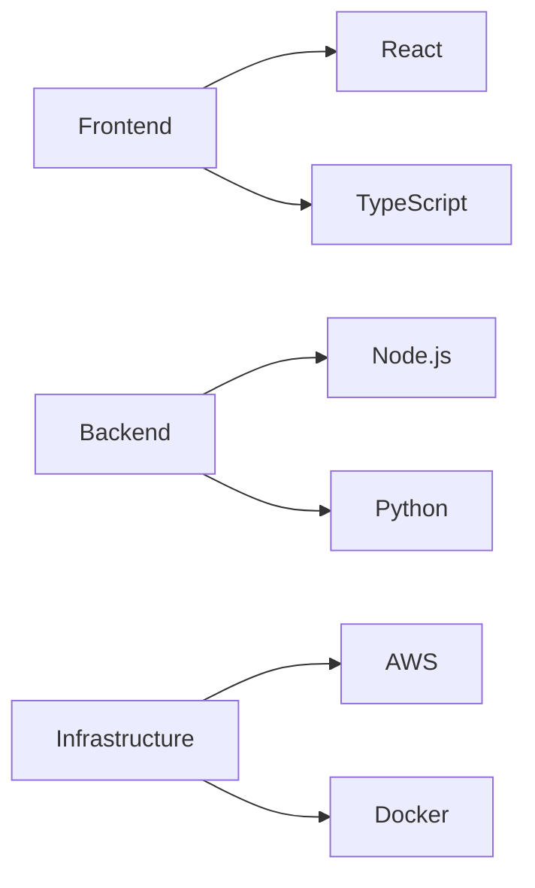

# Welcome to Gandaria Ventures Limited 👋

We're on a mission to To deliver superior products and services across our business sectors while driving positive socio economic change in the communities we serve. Our community brings together passionate developers, designers, and innovators to create technology that matters.

## 🌟 What We Do

At Gandaria Ventures Limited, we believe in building software that makes a difference. Our projects focus on:

- **Open Source Development**: Creating and maintaining tools that empower developers worldwide
- **Innovation**: Pushing boundaries and exploring new technological frontiers
- **Community**: Fostering an inclusive environment where everyone can contribute and grow

## 🚀 Featured Projects

### Project Alpha
Revolutionary data processing pipeline with real-time analytics
- [Repository Link]
- [Documentation]

### Project Beta
Next-generation UI component library
- [Repository Link]
- [Documentation]

## 💡 Contributing

We love contributions from our community! Whether you're fixing bugs, adding new features, or improving documentation, your help is welcome.

1. Check out our [Contribution Guidelines](CONTRIBUTING.md)
2. Review our [Code of Conduct](CODE_OF_CONDUCT.md)
3. Find an issue that interests you
4. Fork, code, and submit a Pull Request!

## 🤝 Join Our Community

- 💬 Join our [Discord Server]
- 📫 Follow us on [Twitter]
- 📝 Read our [Blog]
- 👥 Connect on [LinkedIn]

## 📊 Organization Stats

## 🎯 Our Technology Stack

## 📝 License

Most of our projects are licensed under the MIT License - see the individual repositories for specific details.

---

Made with ❤️ by the Gandaria Ventures Limited IT Team

